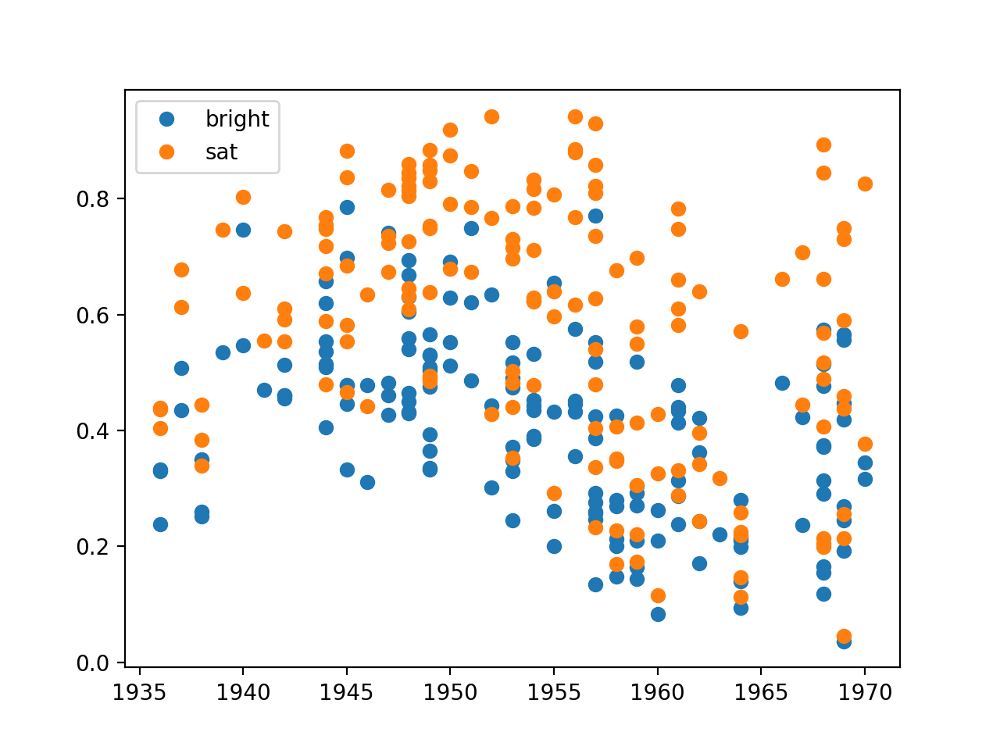

# Rothko

To get images:

``` bash
python3 scraper.py
```

To run analysis and display graph
``` bash
python3 analysis.py
```

Final result

*do note that 18 of scraped pictures have significant white borders*

